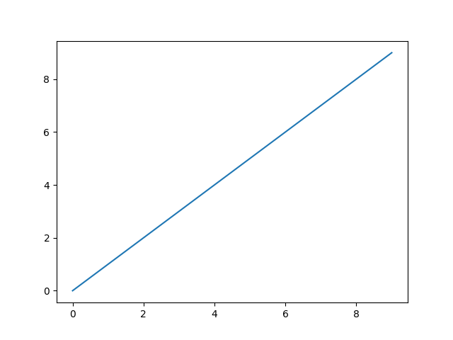
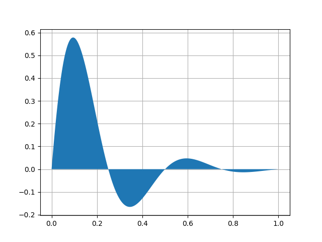

# Instalação do Python

## A partir dos fontes

```bash
wget wget https://www.python.org/ftp/python/2.7.13/Python-2.7.13.tgz
tar xf Python-2.7.13.tgz
cd Python-2.7.13/
echo "Instalando o Python no diretório $HOME/R"
./configure --prefix=$HOME/python
make && make install
cd ~/
ls -la python
echo "#" >> ~/.profile
echo "export PATH=~/python/bin:\$PATH" >> ~/.profile
echo "#" >> ~/.profile
export PATH=~/python/bin:$PATH
```

## Instalação de pacotes

**pip** é usado para instalar pacotes python. Precisamos instalar _pip_ de forma que ele instale os pacotes para a versão do Python correta.

```bash
wget --no-check-certificate https://bootstrap.pypa.io/get-pip.py -O - | python - --user
ls .local/bin .local/lib
echo "#" >> ~/.profile
echo "export PATH=.local/bin:\$PATH" >> ~/.profile
echo "#" >> ~/.profile
export PATH=.local/bin:$PATH
```

## Instalando SciPy e matplotlib


```
# Pode ser necessário instalar os pacotes no Linux
# sudo apt-get install libblas-dev liblapack-dev libatlas-base-dev gfortran
pip install scipy
python -m pip install -U pip setuptools
python -m pip install matplotlib
```

## Testando SciPy

```
import numpy
scores=numpy.array([114, 100, 104, 89, 102, 91, 114, 114, 103, 105, 108, 130, 120, 132, 111, 128, 118, 119, 86, 72, 111, 103, 74, 112, 107, 103, 98, 96, 112, 112, 93])
from scipy import stats
result=scipy.stats.bayes_mvs(scores)
help(scipy.stats.bayes_mvs)
import scipy
help(scipy.stats.bayes_mvs)
numpy.info('random')
help(scipy.stats)
help(scipy.stats.kurtosis)

import matplotlib as mpl
mpl.use('Agg')
import matplotlib.pyplot as plt

fig = plt.figure()
ax = fig.add_subplot(111)
ax.plot(range(10))
fig.savefig('temp.png')
```



```
x = numpy.linspace(0, 1, 500)
y = numpy.sin(4 * numpy.pi * x) * numpy.exp(-5 * x)
fig, ax = plt.subplots()
ax.fill(x, y, zorder=10)
ax.grid(True, zorder=5)
plt.show()
fig.savefig('sin.png')
```



