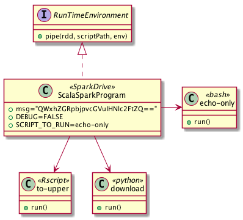

# Usando o método pipe do RDD

Nos exemplos abaixo cada linha é decodificada de base64 e passada adiante via pipe do BASH para o script 

```scala
// Forçando ocorrencia de erro na váriável de ambiente
// TODO: Falta tratar erro de script não existe dentro da shell decode-base64-and-run-script.sh
val dataRRDD = sc.makeRDD(List("QWxhZGRpbjpvcGVuIHNlc2FtZQ=="))
val piped = dataRRDD.pipe("/spark/DATA/decode-base64-and-run-script.sh", Map("XXX" -> "/spark/DATA/to-upper.sh"))
val result = piped.collect()
result.foreach(println)
```

Executando uma shell bash que faz **apenas um echo** para stdout.
Neste echo a shell coloca como prefixo o nome do HOST do cluster onde ela foi executada.
Lembre-se: Cada tupla do RDD pode rodar em _hosts_ diferentes. 

```scala
val dataRRDD = sc.makeRDD(List("QWxhZGRpbjpvcGVuIHNlc2FtZQ=="))
val env = Map("SCRIPT_TO_RUN" -> "/spark/DATA/echo-only.sh")
val piped = dataRRDD.pipe("/spark/DATA/decode-base64-and-run-script.sh", env)
val result = piped.collect()
result.foreach(println)
```

Executando uma shell bash que faz apenas uma **conversão para maíusculos** e ecoa para stdout.
Neste echo a shell coloca como prefixo o nome do HOST do cluster onde ela foi executada.

```scala
val dataRRDD = sc.makeRDD(List("QWxhZGRpbjpvcGVuIHNlc2FtZQ=="))
val env = Map("SCRIPT_TO_RUN" -> "/spark/DATA/to-upper.sh")
val piped = dataRRDD.pipe("/spark/DATA/decode-base64-and-run-script.sh", env)
val result = piped.collect()
result.foreach(println)
```

